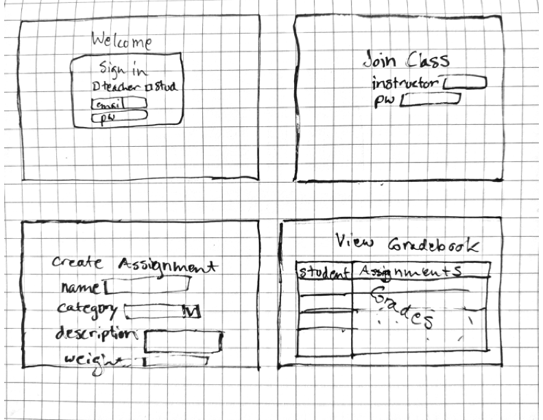
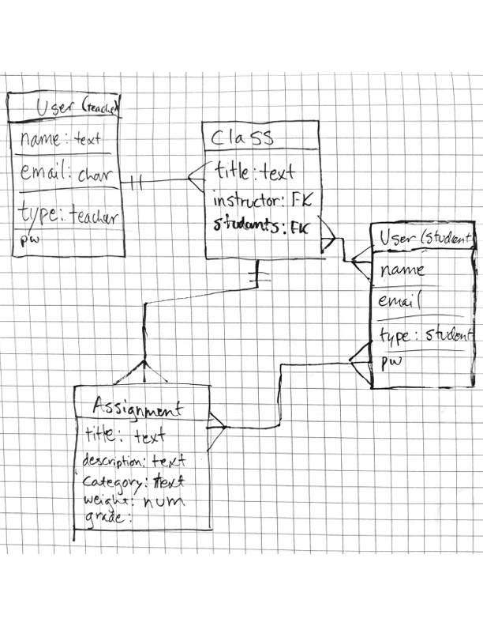

# Generic Gradebook
---

## Overview
---
As a high school teacher, I was constantly frustrated by the gradebook software provided to me. In addition, many of my colleagues struggled to figure out how to actually set up the grade calculation in a way they liked. My aim with this gradebook app is to make a simple, easy-to-use platform for teachers to enter and calculate grades, that does all the calculation for you, while still being easy to manipulate.

---
## User Stories
---
As a user (teacher), I would like to be able to:
- Create an Account
- Login/logout of my account
- Retrieve forgotten password/email
- Create a class
- Create assignments in a class
- Add students to a class
- Enter grades in a student's assignment
- Mark a student's assignment as missing
As a user (student), I would like to be able to:
- Create an Account
- Login/logout of my account
- Retrieve forgotten password/email
- Join a class
- View my assignments
- View my grades
- View my missing assignments

---
## Wireframes
---

---
## ERDs
---

